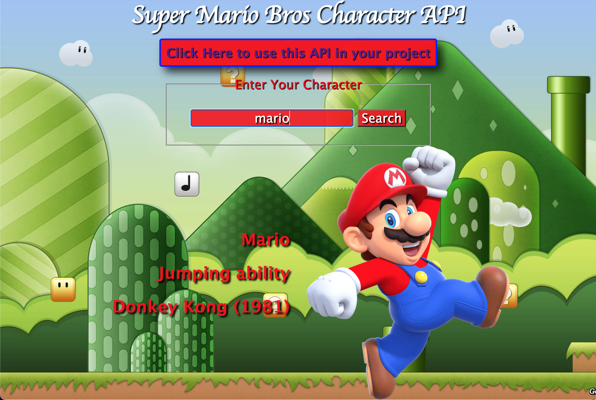
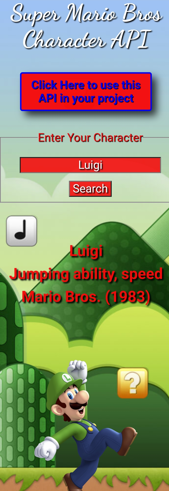

<h1 align="center">Simple Super Mario Bros Character API</h1>
<table bordercolor="#66b2b2">

<tr>
<td width="50%" valign="top">

</td>

<td width="50%" valign="top">
<p align="center"></p>       
</td>
</tr>
</table>

<p>Take a look at it here on cyclic 👉 https://simple-mario-character-api.vercel.app/</p>
<p>https://super-mario-bros-character-api.onrender.com/</p>
<p>*Render does take a minute to spin up the first time*</p>

<h2 align="center">Technology Used</h2>
    <p align="center"> 
    <a href="https://www.w3schools.com/css/" target="_blank"
            rel="noreferrer">  </a> 
    <a href="https://git-scm.com/" target="_blank"
            rel="noreferrer">  </a> 
    <a href="https://www.w3.org/html/" target="_blank" rel="noreferrer">  </a> 
    <a href="https://developer.mozilla.org/en-US/docs/Web/JavaScript" target="_blank" rel="noreferrer">  </a> 
           <!--- <a href="https://nodejs.org" target="_blank"
            rel="noreferrer">  </a> --->
                
                <a href="https://postman.com" target="_blank"
            rel="noreferrer">  </a> 
                
     <a align="center" href="https://www.photoshop.com/en" target="_blank" rel="noreferrer"> </p>
     
<h2 align="center">About</h2>
<p>This is a simple API with the character objects stored server side. When you enter the characters name it will display thier name, ability, the first game they appeared in, and their picture.
     
<h2 align="center">How to use it in your own project</h2>
<p>Place this url in your fetch - `https://odd-colt-vestments.cyclic.app/api/${characterName}`</p>
<p>${characterName} should take the input value from ~input type="text"~ if you're using a search bar or ~input type="radio"~ if you're using a radio button.</p>
<p>Your client side javascript fetch would look like this.</p>

```
async function apiRequest() {
    const characterName = document.querySelector('#searchBar').value.toLowerCase()
    try {
        const response = await fetch(`https://odd-colt-vestments.cyclic.app/api/${characterName}`)
        const data = await response.json()

        console.log(data)

        document.getElementById('name').innerText = data.name

        document.getElementById('strength').innerText = data.strength

        document.getElementById('origin').innerText = data.origin

        document.querySelector('img').src = data.image
        
    } catch (error) {
        console.log(error)
    }
}
```
